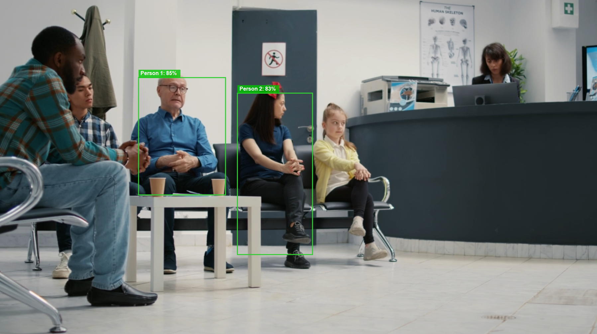

# Contoso.AI.PersonDetector

[](https://github.com/contosomodels/PersonDetector/actions/workflows/build-and-publish.yml)
[](https://www.nuget.org/packages/Contoso.AI.PersonDetector/)
[](https://www.nuget.org/packages/Contoso.AI.PersonDetector/)

AI-powered person detection for images using ONNX Runtime and the Yolo-X model. Built for .NET 8 on Windows with NPU acceleration via QNN Execution Provider.

> **Windows Only**: This package requires Windows 10 SDK version 19041 or later and uses Windows-specific AI APIs.



## ✨ Features

- 🤖 **AI-Powered Detection** - Uses Qualcomm's Yolo-X ONNX model for accurate person detection
- 📦 **Bounding Boxes** - Returns precise bounding boxes with confidence scores for each detected person
- ⚡ **NPU Acceleration** - Hardware-accelerated inference via QNN Execution Provider (falls back to CPU on other devices)
- 🪟 **Windows Native** - Built with Windows App SDK for optimal performance
- 📦 **Easy Integration** - Simple NuGet package with automatic model download
- 🔒 **Type Safe** - Full C# type safety with nullable reference types

## 🚀 Quick Start

### Installation

```bash
dotnet add package Contoso.AI.PersonDetector
```

**Platform Requirements:**
- ✅ Windows 10 version 2004 (build 19041) or later
- ❌ Not compatible with: Linux, macOS, or older Windows versions

### Basic Usage

```csharp
using Contoso.AI;
using System.Drawing;

// Check if the person detection feature is ready
var readyState = PersonDetector.GetReadyState();

if (readyState != AIFeatureReadyState.Ready)
{
    // Prepare the feature (downloads QNN Execution Provider if needed)
    var readyResult = await PersonDetector.EnsureReadyAsync();
    if (readyResult.Status != AIFeatureReadyResultState.Success)
    {
        // Handle initialization failure
        Console.WriteLine($"Failed to initialize: {readyResult.ExtendedError?.Message}");
        return;
    }
}

// Create detector instance
using var detector = await PersonDetector.CreateAsync();

// Load and detect people in an image
using var bitmap = new Bitmap("path/to/image.png");
var result = detector.DetectPeople(bitmap);

Console.WriteLine($"Total people detected: {result.TotalPeopleCount}");
foreach (var person in result.People)
{
    Console.WriteLine($"  Confidence: {person.Confidence:P2}");
    Console.WriteLine($"  Bounding Box: X={person.BoundingBox.X:F1}, Y={person.BoundingBox.Y:F1}, " +
                      $"Width={person.BoundingBox.Width:F1}, Height={person.BoundingBox.Height:F1}");
}

// Don't forget to dispose
detector.Dispose();
```

## 📁 Project Structure

```
PersonDetector/
├── Contoso.AI.PersonDetector/               # Main library
│   ├── PersonDetector.cs                    # Core detection engine
│   ├── PersonDetectionResult.cs             # Detection result model
│   └── Detection.cs                         # Individual detection model
├── Contoso.AI.PersonDetector.ConsoleTest/   # Console test app
│   └── Program.cs                           # Test runner
├── .github/workflows/                       # CI/CD pipelines
│   └── build-and-publish.yml                # Automated build & publish
└── README.md                                # This file
```

## ⚙️ Requirements

- **Platform**: Windows 10 (19041) or later
- **Runtime**: .NET 8.0
- **SDK**: Windows App SDK 1.8+
- **Architecture**: x64 or ARM64

## 🛠️ Development Setup

### Prerequisites

1. [Visual Studio 2022](https://visualstudio.microsoft.com/) or later
2. [.NET 8 SDK](https://dotnet.microsoft.com/download/dotnet/8.0)
3. Windows 10 SDK (19041 or later)

### Clone and Build

```bash
# Clone the repository
git clone https://github.com/contosomodels/PersonDetector.git
cd PersonDetector

# Restore dependencies
dotnet restore

# Build the solution
dotnet build

# Run tests
dotnet run --project Contoso.AI.PersonDetector.ConsoleTest
```

### Model Download

The Yolo-X ONNX model is automatically downloaded during the first build. It's cached in the `obj/Models/Yolo-X_w8a8/` directory to avoid re-downloading on subsequent builds. The model files (`model.onnx` and `model.data`) are automatically copied to your output directory.

## 🧪 Testing

The project includes a console-based test runner:

```bash
dotnet run --project Contoso.AI.PersonDetector.ConsoleTest
```

**Expected Output:**
```
=== Person Detector Console Test ===

Initializing detector...
✓ Detector initialized successfully

Testing image: test_image.png
Detected 3 people
  Person 1: Confidence 95.2%, Box: (120, 45, 180, 320)
  Person 2: Confidence 89.7%, Box: (340, 60, 150, 290)
  Person 3: Confidence 82.1%, Box: (520, 80, 140, 275)

✓ All tests passed!
```

## 📦 NuGet Package

The package is automatically built and published via GitHub Actions on every push to `main`.

### Version Scheme

- **Format**: `0.1.[BUILD_NUMBER]-beta`
- **Example**: `0.1.42-beta`

Versions increment automatically based on the GitHub Actions run number.

### Manual Publishing

If you need to publish manually:

```bash
dotnet pack Contoso.AI.PersonDetector -c Release
dotnet nuget push "bin/Release/*.nupkg" --api-key YOUR_API_KEY --source https://api.nuget.org/v3/index.json
```

## 🤝 Contributing

Contributions are welcome! Please follow these steps:

1. **Fork** the repository
2. **Create** a feature branch (`git checkout -b feature/amazing-feature`)
3. **Commit** your changes (`git commit -m 'Add amazing feature'`)
4. **Push** to the branch (`git push origin feature/amazing-feature`)
5. **Open** a Pull Request

### Pull Request Process

- PRs trigger automated builds and tests
- All tests must pass before merging
- Code should follow existing style conventions
- Update documentation as needed

## 🔄 CI/CD Pipeline

The project uses GitHub Actions for automated builds:

- **On Pull Request**: Builds and runs tests (no publishing)
- **On Push to Main**: Builds, tests, and publishes to NuGet

See [GITHUB_ACTIONS_SETUP.md](GITHUB_ACTIONS_SETUP.md) for setup details.

## 📚 API Reference

### `PersonDetector`

#### Static Methods

```csharp
// Check if detector is ready
AIFeatureReadyState GetReadyState()

// Initialize shared resources (downloads QNN EP if needed)
Task<AIFeatureReadyResult> EnsureReadyAsync()

// Create detector instance with NPU acceleration
Task<PersonDetector> CreateAsync()
```

#### Instance Methods

```csharp
// Detect people in a bitmap image
PersonDetectionResult DetectPeople(Bitmap bitmap)

// Clean up resources
void Dispose()
```

### `PersonDetectionResult`

```csharp
public class PersonDetectionResult
{
    public List<Detection> People { get; set; }
    public int TotalPeopleCount { get; set; }
}
```

### `Detection`

```csharp
public class Detection
{
    public string ClassName { get; set; }      // e.g., "Person"
    public float Confidence { get; set; }      // 0.0 to 1.0
    public RectangleF BoundingBox { get; set; } // X, Y, Width, Height
}
```

## 💡 Use Cases

- **Security Systems**: Detect and count people in surveillance footage
- **Retail Analytics**: Monitor customer traffic and store occupancy
- **Smart Home**: Trigger automations when people are detected
- **Photo Organization**: Automatically tag images containing people
- **Access Control**: Verify human presence for entry systems

## 🔧 Advanced Configuration

### Execution Provider

The detector uses NPU acceleration via the QNN Execution Provider for optimal performance on compatible hardware. The QNN EP is automatically downloaded on first use if not already present.

### Model Information

- **Source**: [Qualcomm/Yolo-X on HuggingFace](https://huggingface.co/qualcomm/Yolo-X)
- **Type**: Yolo-X ONNX model (quantized w8a8)
- **Input Size**: 640x640 pixels
- **License**: Check the model repository for license information

## 📄 License

This project is licensed under the MIT License - see the [LICENSE](LICENSE) file for details.

## 🙏 Acknowledgments

- **Qualcomm** - For the [Yolo-X model](https://huggingface.co/qualcomm/Yolo-X)
- **Microsoft** - For ONNX Runtime and Windows App SDK
- **Community** - For feedback and contributions

## 📞 Support

- **Issues**: [GitHub Issues](https://github.com/contosomodels/PersonDetector/issues)
- **Discussions**: [GitHub Discussions](https://github.com/contosomodels/PersonDetector/discussions)
- **NuGet**: [Package Page](https://www.nuget.org/packages/Contoso.AI.PersonDetector/)

## 🗺️ Roadmap

- [ ] Add support for video stream processing
- [ ] Support for batch image processing
- [ ] Add confidence threshold configuration
- [ ] Performance benchmarking suite
- [ ] Multi-class object detection (beyond persons)
- [ ] Web API wrapper example

---

**Made with ❤️ by Contoso**
